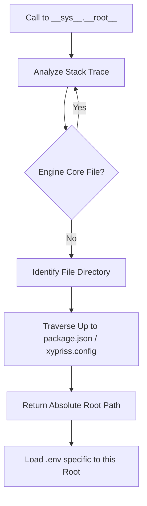

# XyPriss Root Management Algorithm

This document details the operation of the root management algorithm in the XyPriss framework. This algorithm enables module isolation, contextual environment variable management, and secure file path resolution.

## Central Objective

The goal is to enable the framework to be "Context-Aware." When a module (or plugin) accesses `__sys__.__root__` or loads an environment variable, the system must dynamically identify whether it is the main user code or an isolated plugin, without the developer having to manually pass path references everywhere.

## 1. Heuristic Project Identification

The base unit is the "Project." A directory is considered a project root (`Project Root`) if it meets the criteria defined in `src/utils/ProjectDiscovery.ts`.

### Detection Criteria (`isProjectRoot`):

- Presence of `package.json` **AND** one of the following:
    - `node_modules` folder.
    - `xypriss.config.json` or `xypriss.config.jsonc` file.
    - `src/` + `tsconfig.json` duo.
- As a last resort, a reading of `package.json` checks for the presence of valid `name` and `version` fields.

## 2. Dynamic Discovery via Stack-Trace (`getCallerProjectRoot`)

This is the heart of the algorithm. To determine the root of the code currently executing:

1.  **Capture the call stack**: An error is generated to obtain the `stack` object.
2.  **Selective Filtering**:
    - **Engine Core**: The system ignores files belonging to the pure XyPriss engine (e.g., `src/server`, `src/xhsc`, `src/utils/ProjectDiscovery.ts`). These files are considered "infrastructure."
    - **Internal Mods**: Files located in `/mods/` are **NOT** ignored. Although they are part of the framework repository, they are treated as independent projects to ensure their isolation (own environment variables, own `__root__`).
3.  **Locate the Caller**: The first file found that does not belong to the Engine Core is considered the origin of the call.
4.  **Traverse Up the Tree**: Starting from this file, the system moves up the parent directories until it finds a valid project root (via `isProjectRoot`).

## 3. Scoped Environment Management (`EnvApi`)

The `__sys__.__env__` API uses this dynamic discovery to load the correct variables:

- Each identified project has its own dictionary of variables loaded from its respective `.env` file.
- During a `__sys__.__env__.get("VAR")`, `EnvApi` identifies the caller's root and queries the corresponding dictionary.
- This allows a plugin in `/mods/swagger` to have its own `HELLO` without interfering with the main server's.

## 4. Sandboxing and `workspaceSYS` (`System / XyPrissFS`)

For increased security, plugins can request access to their own "System" via `__sys__.plugins.get(name)`.

- **Isolation**: This mechanism returns a system instance (`XyPrissFS`) whose root (`__root__`) is immutably locked to the plugin's directory.
- **Authorization**: Access must be explicitly authorized in the `xypriss.config.jsonc` configuration via the `$internal` block.

## 5. Path Resolution (`ROOT://` vs `CWD://`)

The system supports path prefixes to clarify intent:

- `ROOT://`: Resolves the path relative to the project root identified by the algorithm (e.g., the plugin root if the call comes from the plugin).
- `CWD://`: Resolves the path relative to the current working directory of the process (`process.cwd()`), regardless of where the call comes from.

## 6. Hierarchy Resolution (Nested Projects)

The algorithm naturally handles nested project structures (e.g., a project "B" located inside project "A").

### Proximity Rule

Root identification uses a top-down search strategy (from the file toward the system root):

- The system stops as soon as it encounters the **first** valid root.
- This means that if a sub-folder meets the `isProjectRoot` criteria, it becomes its own independent root.
- It "shadows" the parent project root for all code located within its directory tree.

### Independence Scenario

If a module in project "A" evolves to become autonomous (adding a `package.json`, `src/`, and `tsconfig.json`), it will no longer be attached to "A" during dynamic discovery. It will have its own `__sys__.__root__` and its own environment variables (`.env`).

## Execution Flow Summary



```markdown
---

This architecture ensures that the framework remains modular, secure, and easy to use for plugin developers while protecting the integrity of the overall system.

**Document Information**

| Attribute | Details |
| :--- | :--- |
| **Author** | Nehonix |
| **Contributors** | [Zetad](https://github.com/zetad2), [iDevo](https://github.com/iDevo-ll) |
| **Creation Date** | April 7, 2026 |
| **Last Updated** | April 18, 2026 |
| **Status** | Internal document, validated and committed |
```
