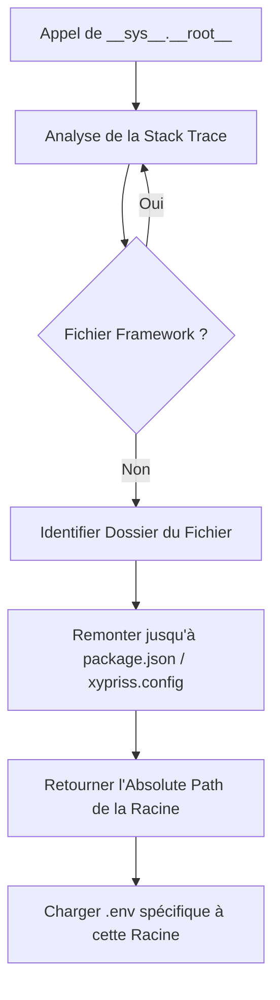

# XyPriss Root Management Algorithm

Ce document détaille le fonctionnement de l'algorithme de gestion des racines (roots) dans le framework XyPriss. Cet algorithme permet l'isolation des modules, la gestion contextuelle des variables d'environnement et la résolution sécurisée des chemins de fichiers.

## Objectif Central

L'objectif est de permettre au framework d'être "conscient de son contexte" (Context-Aware). Lorsqu'un module (ou un plugin) accède à `__sys__.__root__` ou charge une variable d'environnement, le système doit identifier dynamiquement s'il s'agit du code utilisateur principal ou d'un plugin isolé, sans que le développeur n'ait à passer manuellement des références de chemin partout.

## 1. Identification Heuristique du Projet

L'unité de base est le "Projet". Un répertoire est considéré comme une racine de projet (`Project Root`) s'il respecte les critères définis dans `src/utils/ProjectDiscovery.ts`.

### Critères de Détection (`isProjectRoot`) :

- Présence de `package.json` **ET** l'un des éléments suivants :
    - Dossier `node_modules`.
    - Fichier `xypriss.config.json` ou `xypriss.config.jsonc`.
    - Duo `src/` + `tsconfig.json`.
- En dernier recours, une lecture du `package.json` vérifie la présence de champs `name` et `version` valides.

## 2. Découverte Dynamique via Stack-Trace (`getCallerProjectRoot`)

C'est le cœur de l'algorithme. Pour déterminer la racine du code en cours d'exécution :

1.  **Capture de la pile d'appels** : Une erreur est générée pour obtenir l'objet `stack`.
2.  **Filtrage Sélectif** :
    - **Engine Core** : Le système ignore les fichiers appartenant au moteur pur de XyPriss (ex: `src/server`, `src/xhsc`, `src/utils/ProjectDiscovery.ts`). Ces fichiers sont considérés comme "infrastructure".
    - **Internal Mods** : Les fichiers situés dans `/mods/` ne sont **PAS** ignorés. Bien qu'ils fassent partie du dépôt du framework, ils sont traités comme des projets indépendants pour garantir leur isolation (propres variables d'environnement, propre `__root__`).
3.  **Localisation du Caller** : Le premier fichier trouvé qui n'appartient pas à l'Engine Core est considéré comme l'origine de l'appel.
4.  **Remontée de l'Arborescence** : À partir de ce fichier, le système remonte les répertoires parents jusqu'à trouver une racine de projet valide (via `isProjectRoot`).

## 3. Gestion des Environnements Scopés (`EnvApi`)

L'API `__sys__.__env__` utilise cette découverte dynamique pour charger les bonnes variables :

- Chaque projet identifié possède son propre dictionnaire de variables chargé depuis son fichier `.env` respectif.
- Lors d'un `__sys__.__env__.get("VAR")`, `EnvApi` identifie la racine de l'appelant et interroge le dictionnaire correspondant.
- Cela permet à un plugin dans `/mods/swagger` d'avoir son propre `HELLO` sans interférer avec celui du serveur principal.

## 4. Bac à Sable et `workspaceSYS` (`System / XyPrissFS`)

Pour une sécurité accrue, les plugins peuvent demander un accès à leur propre "Système" via `__sys__.plugins.get(name)`.

- **Isolation** : Ce mécanisme retourne une instance de système (`XyPrissFS`) dont la racine (`__root__`) est verrouillée de manière immuable sur le répertoire du plugin.
- **Autorisation** : L'accès doit être explicitement autorisé dans la configuration `xypriss.config.jsonc` via le bloc `$internal`.

## 5. Résolution des Chemins (`ROOT://` vs `CWD://`)

Le système supporte des préfixes de chemins pour clarifier l'intention :

- `ROOT://` : Résout le chemin par rapport à la racine du projet identifiée par l'algorithme (ex: la racine du plugin si l'appel vient du plugin).
- `CWD://` : Résout le chemin par rapport au répertoire de travail actuel du processus (`process.cwd()`), peu importe d'où vient l'appel.

## 6. Résolution de la Hiérarchie (Projets Imbriqués)

L'algorithme gère naturellement les structures de projets imbriqués (ex: un projet "B" situé à l'intérieur d'un projet "A").

### Règle de Proximité

L'identification de la racine utilise une stratégie de recherche descendante (depuis le fichier vers la racine du système) :

- Le système s'arrête dès qu'il rencontre la **première** racine valide.
- Cela signifie que si un sous-dossier respecte les critères `isProjectRoot`, il devient sa propre racine indépendante.
- Il "masque" (shadow) la racine du projet parent pour tout le code situé à l'intérieur de son arborescence.

### Scénario d'Indépendance

Si un module du projet "A" évolue pour devenir autonome (ajout d'un `package.json`, `src/` et `tsconfig.json`), il ne sera plus rattaché à "A" lors de la découverte dynamique. Il disposera de son propre `__sys__.__root__` et de ses propres variables d'environnement (`.env`).

## Résumé du Flux d'Exécution

---

**Auteur :** Nehonix  
**Contributeurs :** [Zetad](https://github.com/zetad2) & [iDevo](https://github.com/iDevo-ll)  
_Document validé et commité le 7 avril 2026._
Cette architecture garantit que le framework reste modulaire, sécurisé et facile à utiliser pour les développeurs de plugins tout en protégeant l'intégrité du système global.

