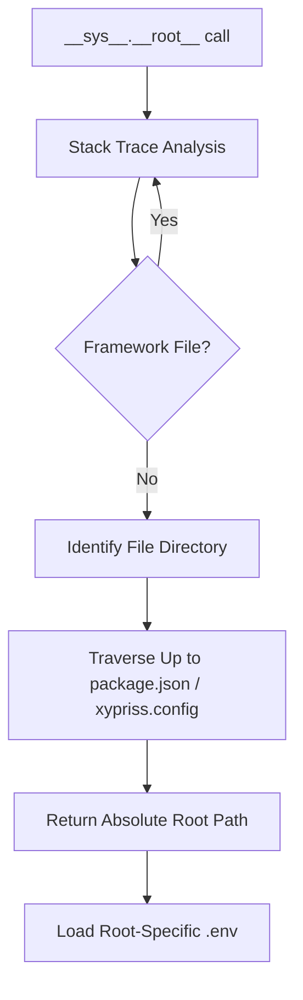

# XyPriss Root Management Algorithm

This document details the internal mechanics of the root management algorithm within the XyPriss framework. This algorithm ensures module isolation, context-aware environment variable management, and secure file path resolution.

## Core Objective

The primary goal is to enable the framework to be "Context-Aware." When a module or plugin accesses `__sys__.__root__` or loads an environment variable, the system must dynamically identify whether it is executing within the main user code or an isolated plugin. This eliminates the need for developers to manually pass path references throughout the codebase.

## 1. Heuristic Project Identification

The fundamental unit of the system is the "Project." A directory is recognized as a project root (`Project Root`) if it meets the criteria defined in `src/utils/ProjectDiscovery.ts`.

### Detection Criteria (`isProjectRoot`):

- Presence of `package.json` **AND** at least one of the following:
    - `node_modules` directory.
    - `xypriss.config.json` or `xypriss.config.jsonc` file.
    - `src/` directory paired with `tsconfig.json`.
- As a fallback, the system reads `package.json` to verify valid `name` and `version` fields.

## 2. Dynamic Discovery via Stack-Trace Analysis (`getCallerProjectRoot`)

This is the core of the algorithm. To determine the root of the currently executing code:

1.  **Capture Call Stack**: An error is generated to retrieve the `stack` object.
2.  **Framework Filtering**: The system iterates through the stack, ignoring all files belonging to the XyPriss core (e.g., `sys.ts`, `EnvApi.ts`, `ProjectDiscovery.ts`).
3.  **Caller Localization**: The first non-framework file found is identified as the origin of the call.
4.  **Tree Traversal**: Starting from that file's directory, the system traverses upward until it finds a valid project root (via `isProjectRoot`).

## 3. Scoped Environment Management (`EnvApi`)

The `__sys__.__env__` API leverages this dynamic discovery to load appropriate variables:

- Each identified project maintains its own dictionary of variables loaded from its specific `.env` file.
- During a `__sys__.__env__.get("VAR")` call, `EnvApi` identifies the caller's root and queries the corresponding dictionary.
- This allows a plugin in `/mods/swagger` to have its own `HELLO` variable without conflicting with the main server's environment.

## 4. Workspace Sandboxing and `workspaceSYS` (`System / XyPrissFS`)

For enhanced security, plugins can request access to their own "System" instance via `__sys__.plugins.get(name)`.

- **Isolation**: This mechanism returns a dedicated system instance (`XyPrissFS`) with its `__root__` immutably locked to the plugin's directory.
- **Authorization**: Access must be explicitly granted in the `xypriss.config.jsonc` configuration within the `$internal` block.

## 5. Path Resolution (`ROOT://` vs `CWD://`)

The system supports specific path prefixes to clarify intent:

- `ROOT://`: Resolves paths relative to the project root identified by the algorithm (e.g., the plugin's root if the call originates from the plugin).
- `CWD://`: Resolves paths relative to the current working directory of the process (`process.cwd()`), regardless of the call origin.

## 6. Hierarchical Resolution (Nested Projects)

The algorithm naturally handles nested project structures (e.g., a project "B" located inside a project "A").

### Proximity Rule

Root identification uses an upward search strategy (from the file toward the system root):

- The system stops as soon as it encounters the **first** valid project root.
- This means that if a sub-folder meets the `isProjectRoot` criteria, it becomes its own independent root.
- It "shadows" the parent project root for all code located within its own directory tree.

### Independence Scenario

If a module within project "A" evolves to become autonomous (e.g., by adding a `package.json`, `src/`, and `tsconfig.json`), the dynamic discovery will no longer attach it to "A". It will have its own `__sys__.__root__` and its own set of environment variables (`.env`).

## Execution Flow Overview

This architecture ensures that the framework remains modular, secure, and developer-friendly, protecting the integrity of the global system while providing flexibility for plugins.

