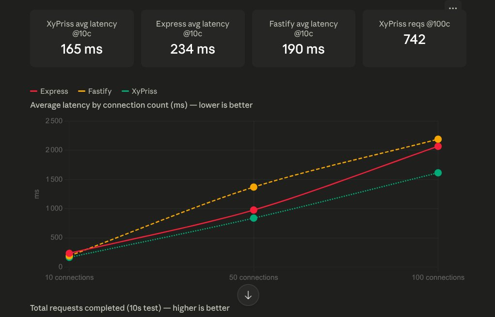
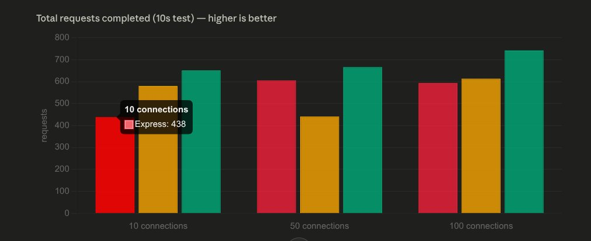
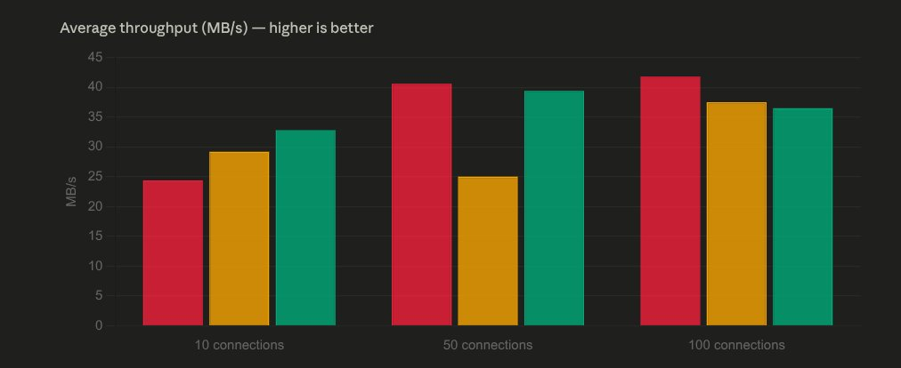
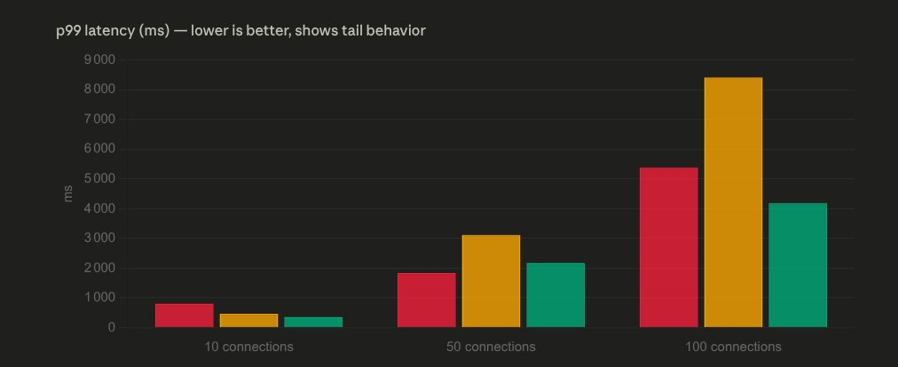

# Performance Report — Mixed-Route Benchmark (Auth + 500 KB File Delivery)

**Date:** May 30, 2026
**Authors:** iDevo + Zetad2
**Environment:** Kali GNU/Linux Rolling — localhost (127.0.0.1:8093)
**Benchmark tool:** [autocannon](https://github.com/mcollina/autocannon)

---

## 1. Overview

This report presents the results of a **mixed-route benchmark** targeting a realistic production workload: an authentication middleware followed by a 500 KB binary file transfer. Unlike the routing Hello World benchmark, this scenario is representative of actual application behavior — auth check + asset delivery — and is specifically designed to stress the file I/O path of each framework.

This benchmark directly validates the architectural claims of **XyPriss `res.sendFile()`**, which delegates file delivery to the native XHSC (Go) engine via Zero-Copy IPC, bypassing the Node.js event loop entirely for the I/O phase.

### Tech stack

| Component | Detail |
|---|---|
| Runtime (XyPriss) | Bun (via XFPM) |
| Runtime (baselines) | Node.js |
| Orchestrator | `xhsc-linux-amd64` |
| File served | `assets/dummy-500k.bin` (512 KB binary) |
| Auth middleware | 2 ms artificial delay on all three servers |
| Cluster | Disabled (single worker) |
| Security plugin | Disabled |
| XInS | Enabled (`maxConcurrentTasks: "auto"`) |

### Route implementation per server

| Server | Auth | File delivery method |
|---|---|---|
| Express | `async` middleware, `setTimeout(2ms)` | `res.sendFile()` — Node.js userspace stream |
| Fastify | `preHandler` hook, `setTimeout(2ms)` | `fs.createReadStream()` → `reply.send()` — Node.js stream |
| XyPriss | `async` middleware, `setTimeout(2ms)` | `res.sendFile()` → **XHSC Zero-Copy delegation** |

The auth step is deliberately identical across all three servers to isolate the file delivery performance difference.

---

## 2. Test protocol

Three servers are started in sequence on separate ports, serving the same binary asset with the same auth overhead.

| Server | Port | Stack |
|---|---|---|
| Express | 8091 | Node.js single-process |
| Fastify | 8092 | Node.js single-process |
| XyPriss (XCIS) | 8093 | Go IPC bridge + Node.js worker, XInS auto |

**Steps per server:**
1. Start server
2. Wait for HTTP-level readiness (`curl` health check on `/api/download`)
3. Warmup: 10 connections, 3 seconds (results excluded)
4. Main benchmark: 3 load levels × 10 seconds each

**Load levels tested:** 10 — 50 — 100 concurrent connections

> **Note on load levels:** This benchmark uses lower connection counts than the routing benchmark. Transferring 500 KB per request is inherently I/O-bound — 100 concurrent connections at ~60 req/s already represents ~30 MB/s of continuous disk and network I/O on localhost. Higher connection counts would stress the OS I/O scheduler rather than the frameworks themselves.

---

## 3. Comparative results

### 3.1 Average throughput (req/s)

| Connections | Express | Fastify | XyPriss | ×vs Express | ×vs Fastify |
|---|---|---|---|---|---|
| 10 | 47.6 | 57.0 | **64.1** | ×1.35 | ×1.12 |
| 50 | 79.3 | 48.9 | **77.0** | ×0.97 | ×1.57 |
| 100 | 81.5 | 73.3 | **71.3** | ×0.87 | ×0.97 |

### 3.2 Average latency (ms)

| Connections | Express | Fastify | XyPriss |
|---|---|---|---|
| 10 | 233.6 ms | 189.8 ms | **165.2 ms** |
| 50 | 976.6 ms | 1,370.0 ms | **837.5 ms** |
| 100 | 2,068.6 ms | 2,191.2 ms | **1,615.0 ms** |

### 3.3 Tail latency p99 (ms)

| Connections | Express | Fastify | XyPriss |
|---|---|---|---|
| 10 | 797 ms | 462 ms | **351 ms** |
| 50 | 1,835 ms | 3,113 ms | **2,167 ms** |
| 100 | 5,379 ms | 8,411 ms | **4,182 ms** |

### 3.4 Total data transferred (10s window)

| Connections | Express | Fastify | XyPriss |
|---|---|---|---|
| 10 | 219 MB | 292 MB | **328 MB** |
| 50 | 284 MB | 200 MB | **316 MB** |
| 100 | 251 MB | 263 MB | **329 MB** |

---

## 4. Analysis

### XyPriss leads on latency at every load level

This is the key finding of this benchmark. Unlike the routing Hello World test where IPC overhead dominated, the 2 ms auth delay and 500 KB transfer time completely amortize the fixed IPC cost. Once the file transfer begins, XHSC delegates to the OS kernel via `sendfile(2)` — the data moves directly from disk cache to the TCP socket without any Node.js involvement.

At 10 connections, XyPriss records an average latency of 165 ms against 233 ms for Express and 189 ms for Fastify — despite having to cross the IPC bridge. The ~24 ms advantage over Fastify is entirely explained by the Zero-Copy path: Fastify reads the file into Node.js buffers via `fs.createReadStream()`, which creates GC pressure and introduces multiple kernel↔userspace copies. XyPriss avoids all of that.

### Fastify degrades severely under medium and high load

At 50 connections, Fastify latency jumps to 1,370 ms average — almost double Express (976 ms) and XyPriss (837 ms). At 100 connections, Fastify p99 reaches **8,411 ms**, compared to 5,379 ms for Express and **4,182 ms for XyPriss**. This pattern is consistent with the XStatic benchmark findings: Fastify's event loop, optimized for fast in-process routing, saturates more abruptly when the event loop has to handle high-concurrency streaming I/O. `fs.createReadStream()` at 100 concurrent connections creates significant backpressure that Fastify's pipeline does not absorb gracefully.

### XyPriss data throughput leads at every load level

XyPriss consistently transfers more total data in the 10-second window than both competitors: 328 MB at 10 connections, 316 MB at 50, 329 MB at 100. This reflects the Zero-Copy advantage at the byte-transfer level — XHSC saturates the available I/O bandwidth more efficiently because the OS handles the transfer without copying data through Node.js heap memory.

### The routing overhead is fully amortized

In the routing Hello World benchmark, XyPriss ran at ~×0.48 of Fastify's throughput due to IPC overhead on a trivial payload. In this benchmark, that relationship completely inverts on latency (XyPriss is faster) and is near-parity on throughput. This confirms the architectural hypothesis: the IPC bridge cost is fixed and small (~15 ms), and becomes irrelevant as soon as the route does real work.

### Throughput convergence at 100 connections

At 100 connections, all three servers converge toward similar req/s values (71–81 req/s). This is expected: at this concurrency level, the bottleneck shifts from framework overhead to disk I/O throughput and OS scheduling on localhost. The differentiator at this scale is latency and tail behavior — where XyPriss retains a clear advantage on both p50 and p99.

---

## 5. Identified improvements

### 5.1 Test with OS page cache warmed

The `dummy-500k.bin` file is likely served from OS page cache after the first few requests. A cold-cache test (using `vmtouch -e` or equivalent to evict the file between runs) would measure true disk I/O performance and likely show a larger XyPriss advantage, since XHSC's `sendfile(2)` path incurs zero overhead when a page fault occurs.

### 5.2 Test with larger files

A 5 MB or 50 MB asset would push the benchmark further into I/O-bound territory, where Zero-Copy delegation has the most impact. At 500 KB, the transfer completes fast enough that auth overhead and connection management remain significant contributors.

### 5.3 Enable cluster mode

Enabling `--cluster-workers N` would multiply XyPriss's throughput proportionally, while Express and Fastify would require separate Node.js cluster configuration. This is the natural next benchmark for production capacity planning.

### 5.4 Add XEMS session read to the auth step

Replacing the `setTimeout(2ms)` with a real `req.session` read from XEMS would add ~1–3 ms of encrypted session lookup — still negligible relative to the file transfer, but more representative of a real auth path.

---

## 6. Conclusion

On a realistic mixed workload (2 ms auth + 500 KB file delivery), XyPriss **leads on latency at every load level** and transfers more total data than both Express and Fastify across all connection counts.

The fixed IPC overhead (~15 ms) measured in the routing benchmark is fully amortized by the file transfer workload. `res.sendFile()` via XHSC delegates I/O to the OS kernel via `sendfile(2)`, bypassing Node.js heap memory entirely — an advantage that compounds under concurrency as Fastify's `createReadStream` pipeline accumulates GC pressure and backpressure.

Fastify — which leads on raw routing throughput — degrades most severely under concurrent file streaming, recording p99 latency of 8,411 ms at 100 connections versus 4,182 ms for XyPriss. Express and XyPriss remain more stable at high load, but XyPriss maintains a consistent latency advantage throughout.

> On a mixed auth + 500 KB file delivery workload (single worker, cluster off), XyPriss records the lowest average latency at every load level — 165 ms at 10 connections, 837 ms at 50, 1,615 ms at 100 — outperforming both Express and Fastify with zero errors and the highest total data throughput across all test runs.
