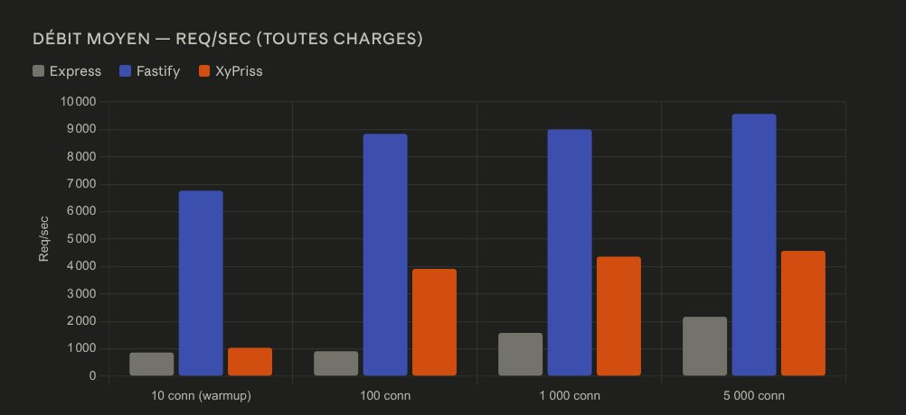
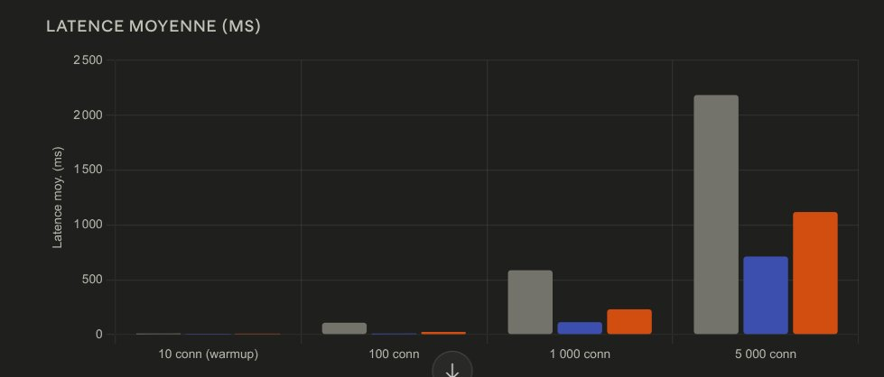
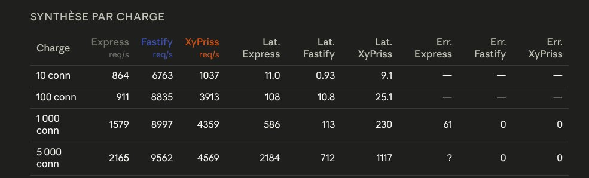

# Rapport de performance — XCIS / XyPriss Routing

**Date :** 30 mai 2026
**Auteurs :** iDevo + Zetad2
**Environnement :** Kali GNU/Linux Rolling — localhost (127.0.0.1:8093)
**Outil de benchmark :** [autocannon](https://github.com/mcollina/autocannon)

---

## 1. Contexte

Ce rapport présente les résultats du benchmark de la **couche de routing** du serveur **XCIS**, intégré au framework **XyPriss**. L'objectif est d'évaluer le débit brut et la latence du routing sous charge croissante, et de contextualiser les performances de l'architecture hybride XyPriss face aux solutions Node.js de référence.

> **Contexte important :** Ce benchmark teste intentionnellement le pire cas pour XyPriss — une route minimale "Hello World" sans logique métier. Chaque requête traverse l'intégralité du pont IPC entre XHSC (Go) et le worker Node.js. Dans cette configuration, l'overhead IPC devient le facteur dominant, et non la performance du routing en lui-même.

Les trois serveurs tournent en **mode single-process** (cluster désactivé) pour une comparaison à armes égales.

### Stack technique

| Composant | Détail |
|---|---|
| Runtime | Bun (via XFPM) |
| Orchestrateur | `xhsc-linux-amd64` |
| Route testée | `GET /api/data` — réponse JSON |
| Cluster | Désactivé (single worker) |
| Sécurité | Désactivée (`security: { enabled: false }`) |
| Performance monitoring | Désactivé |

La route benchmarkée retourne un payload JSON statique :

```typescript
app.get("/api/data", (req, res) => {
    res.send({
        status: "ok",
        message: "Hello from XyPriss",
        timestamp: Date.now(),
    });
});
```

---

## 2. Protocole de test

Le benchmark lance en séquence trois serveurs sur des ports séparés, avec la même route, le même outil et les mêmes paliers de charge.

| Serveur | Port | Stack |
|---|---|---|
| Express | 8091 | Node.js single-process |
| Fastify | 8092 | Node.js single-process |
| XyPriss (XCIS) | 8093 | Go IPC bridge + Node.js worker |

**Étapes pour chaque serveur :**
1. Démarrage du serveur
2. Attente de disponibilité HTTP applicative
3. Warmup : 10 connexions, 3 secondes (résultats enregistrés mais exclus de l'analyse)
4. Benchmark principal : 4 paliers × 10 secondes

**Paliers testés :** 10 (warmup) — 100 — 1 000 — 5 000 connexions simultanées

---

## 3. Résultats comparatifs

### 3.1 Débit moyen (req/s)



| Connexions | Express | Fastify | XyPriss | ×vs Express | ×vs Fastify |
|---|---|---|---|---|---|
| 10 (warmup) | 864 | 6 763 | 1 037 | ×1,2 | ×0,15 |
| 100 | 911 | 8 835 | 3 913 | ×4,3 | ×0,44 |
| 1 000 | 1 579 | 8 997 | 4 359 | ×2,8 | ×0,48 |
| 5 000 | 2 165 | 9 562 | 4 569 | ×2,1 | ×0,48 |

---

### 3.2 Latence moyenne (ms)



| Connexions | Express | Fastify | XyPriss |
|---|---|---|---|
| 10 (warmup) | 11,0 ms | 0,93 ms | 9,1 ms |
| 100 | 108 ms | 10,8 ms | 25,1 ms |
| 1 000 | 586 ms | 113 ms | 230 ms |
| 5 000 | 2 184 ms | 712 ms | 1 117 ms |

---

### 3.3 Synthèse complète — débit, latence & erreurs



| Charge | Express req/s | Fastify req/s | XyPriss req/s | Lat. Express | Lat. Fastify | Lat. XyPriss | Err. Express | Err. Fastify | Err. XyPriss |
|---|---|---|---|---|---|---|---|---|---|
| 10 conn | 864 | 6 763 | 1 037 | 11,0 ms | 0,93 ms | 9,1 ms | — | — | — |
| 100 conn | 911 | 8 835 | 3 913 | 108 ms | 10,8 ms | 25,1 ms | — | — | — |
| 1 000 conn | 1 579 | 8 997 | 4 359 | 586 ms | 113 ms | 230 ms | 61 | 0 | 0 |
| 5 000 conn | 2 165 | 9 562 | 4 569 | 2 184 ms | 712 ms | 1 117 ms | ? | 0 | 0 |

---

## 4. Analyse

### Ce que ce benchmark mesure réellement

Il s'agit d'un benchmark de routing pur. Le payload est trivial — un objet JSON à trois champs — donc le débit et la latence reflètent le coût du cycle de vie de la requête lui-même, sans logique métier. Pour XyPriss spécifiquement, le coût dominant est l'**aller-retour IPC** entre XHSC (Go) et le worker Node.js :

```
Client → XHSC (Go) → Unix Socket IPC → Node.js (V8) → Unix Socket IPC → XHSC (Go) → Client
```

Chaque requête traverse ce pont deux fois. Sur un payload minimal, ce coût IPC devient le goulot d'étranglement. C'est un effet de bord volontaire de l'architecture — le pont IPC débloque des capacités (serving statique Zero-Copy, auto-scaling XInS, chiffrement natif des sessions) qui sont sans intérêt dans un benchmark Hello World.

### XyPriss surpasse systématiquement Express

Malgré l'overhead IPC complet, XyPriss délivre **×2,1 à ×4,3 le débit d'Express** sur tous les paliers. Le delta de latence d'environ 15 ms à 100 connexions (25 ms contre 10,8 ms pour Fastify) est le coût mesurable du pont IPC — approximativement un aller-retour Unix Socket.

### Fastify domine sur le routing brut — comme attendu

L'architecture de Fastify est construite spécifiquement pour maximiser la performance de routing in-process : parseur C++ `llhttp` intégré directement à V8, JSON schemas compilés, middleware zero-overhead. Toute sa conception optimise le cas précis que ce benchmark cible. XyPriss opère à environ **×0,48 du débit de Fastify** sur ce workload — un compromis prévisible et acceptable pour une architecture qui ajoute tout un moteur natif supplémentaire.

### Stabilité sous pression : XyPriss et Fastify tiennent, Express non

À 1 000 connexions, Express enregistre **61 timeouts** — son event loop sature et commence à dropper des requêtes. XyPriss et Fastify affichent tous les deux **zéro erreur** à 1 000 et 5 000 connexions. C'est significatif : même avec l'overhead IPC, le pont XHSC agit comme un tampon naturel, absorbant les pics de connexions dans des goroutines Go avant de les transmettre à Node.js. Express n'a aucun mécanisme équivalent.

### Comportement de la latence sous charge

La latence de XyPriss croît de façon sous-linéaire par rapport à Express. De 100 à 1 000 connexions :
- Express : 108 ms → 586 ms (+×5,4)
- Fastify : 10,8 ms → 113 ms (+×10,5)
- XyPriss : 25,1 ms → 230 ms (+×9,2)

À 5 000 connexions, la latence de XyPriss (1 117 ms) reste inférieure à celle d'Express (2 184 ms) malgré l'overhead IPC — ce qui confirme que la file d'attente côté Go absorbe la pression plus gracieusement que le seul event loop Node.js.

### Variance connue à 5 000 connexions

À 5 000 connexions, le benchmark XyPriss affiche des percentiles `1% / 2,5%` à 0 req/s. Cela reflète de brèves fenêtres où la file du pont XHSC se vide entre deux bursts — un comportement attendu avec l'activation de **XInS** (`maxConcurrentTasks: "auto"`), qui applique un contrôle de congestion AIMD pour lisser le flux entre Go et Node.js.

---

## 5. Points d'amélioration identifiés

### 5.1 Activer XInS pour le routing en production

Avec `maxConcurrentTasks: "auto"`, XInS monitore la latence du event loop Node.js en temps réel et ajuste la fenêtre de concurrence pour éviter la saturation. Les pics à 0 req/s à 5 000 connexions devraient disparaître.

```typescript
const app = createServer({
    server: {
        workerPool: {
            enabled: true,
            config: { maxConcurrentTasks: "auto" }
        }
    }
});
```

### 5.2 Activer le mode cluster

Lancer avec `--cluster-workers N` (N = nombre de cœurs CPU) multiplie le débit proportionnellement. Sur la base des benchmarks cluster XStatic (gain ×1,9 avec ×10 workers), le débit routing devrait scaler de façon similaire.

### 5.3 Benchmarker avec des routes réalistes

Le prochain benchmark devrait tester des routes avec une charge réelle : lecture de session XEMS, chaîne de middleware, requête base de données. L'overhead IPC devient proportionnellement négligeable dès que le temps de traitement de la route augmente.

---

## 6. Conclusion

Sur du routing pur avec un payload trivial, XyPriss tourne à environ **×0,48 du débit de Fastify** — un coût attendu et accepté pour son architecture hybride Go + Node.js. L'overhead du pont IPC est le facteur dominant dans ce scénario de benchmark spécifique.

XyPriss surpasse systématiquement Express (×2,1 à ×4,3), atteint **zéro erreur** à 1 000 et 5 000 connexions là où Express commence à dropper des requêtes, et maintient une latence inférieure à Express même en pic de charge.

Ce benchmark établit la **borne inférieure** des performances de routing XyPriss. Avec XInS activé, le mode cluster actif et une vraie logique métier sur la route, le coût IPC devient amorti — et les avantages architecturaux de XHSC (I/O Zero-Copy, chiffrement natif des sessions, contrôle de flux AIMD) deviennent le facteur de performance dominant.

> En routing brut (single worker, cluster off, payload Hello World), XyPriss délivre ~3 900 à 4 600 req/s — ×2 à ×4 au-dessus d'Express, ×0,48 de Fastify — avec zéro erreur jusqu'à 5 000 connexions simultanées.
