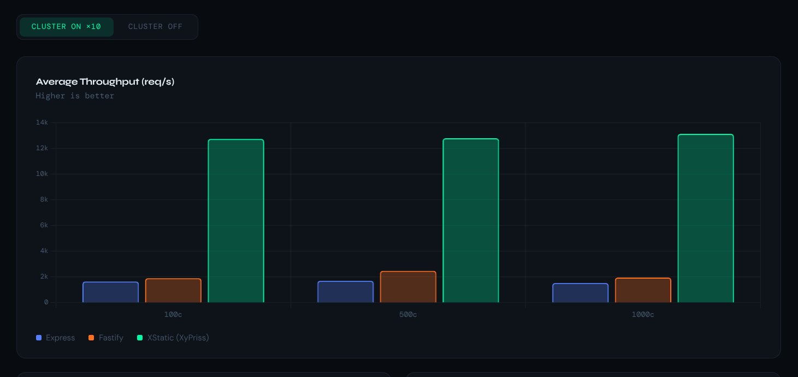
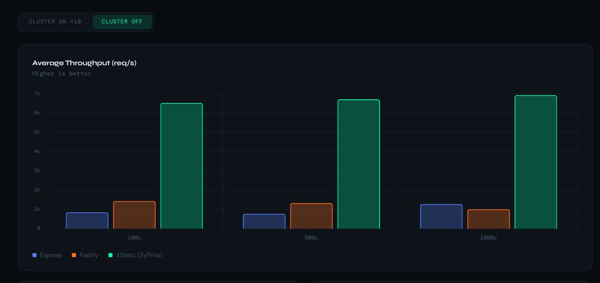
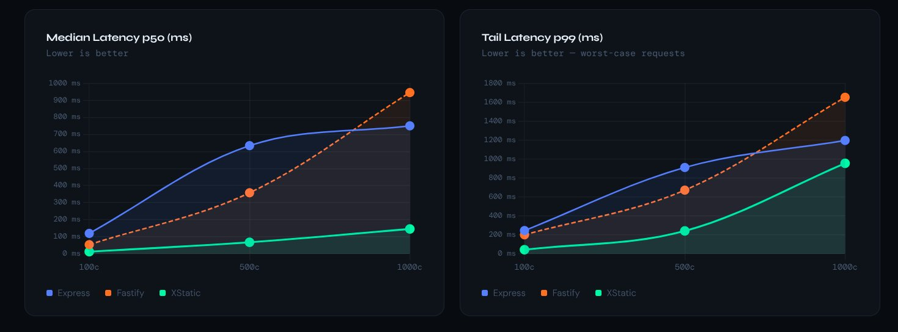

# Rapport de performance — XCIS / XyPriss Fast Path

**Date :** 30 mai 2026
**Author:** iDevo + Zetad2
**Environnement :** Kali GNU/Linux Rolling — localhost (127.0.0.1:8085)
**Outil de benchmark :** [autocannon](https://github.com/mcollina/autocannon)

---

## 1. Contexte

Ce rapport présente les résultats du benchmark de la couche de fichiers statiques du serveur **XCIS**, intégré au framework **XyPriss**. L'objectif est d'évaluer le comportement du serveur sous charge croissante, de valider les gains du Go fast path (XStatic), et de les mettre en perspective face aux solutions Node.js de référence.

Deux scénarios ont été testés pour XStatic :
- **Cluster OFF** — 1 seul worker, comparaison à armes égales avec Express/Fastify
- **Cluster ON (×10)** — configuration de production par défaut

Les baselines Node.js (Express, Fastify) tournent en single-process dans les deux cas.

### Stack technique

| Composant | Détail |
|---|---|
| Runtime | Bun (via XFPM) |
| Orchestrateur | `xhsc-linux-amd64` |
| Fichier servi | `public/texte.txt` (statique) |
| Performance monitoring | Désactivé |
| Compression réseau | Désactivée |
| Rate limiting réseau | Désactivé |

La route benchmarkée est définie via `XStatic` :

```typescript
const xs = new XStatic(app, __sys__);
xs.define("/static", "public");
```

---

## 2. Protocole de test

Le benchmark comparatif lance en séquence trois serveurs sur des ports séparés, avec le même fichier, le même outil, les mêmes paliers de charge.

| Serveur | Port | Stack |
|---|---|---|
| Express + `serve-static` | 8086 | Node.js single-process |
| Fastify + `@fastify/static` | 8087 | Node.js single-process |
| XyPriss XStatic (XCIS) | 8085 | Go fast path via XHSC |

**Étapes pour chaque serveur :**
1. Démarrage du serveur
2. Attente de disponibilité HTTP applicative
3. Warmup : 10 connexions, 3 secondes (résultats exclus)
4. Benchmark principal : 3 paliers × 15 secondes

**Paliers testés :** 100 — 500 — 1 000 connexions simultanées

---

## 3. Résultats comparatifs

### 3.1 Débit moyen (req/s)

#### Cluster ON (×10 workers) — configuration de production



| Connexions | Express | Fastify | XStatic | ×vs Express | ×vs Fastify |
|---|---|---|---|---|---|
| 100 | 1 649 | 1 905 | **12 724** | ×7,7 | ×6,7 |
| 500 | 1 703 | 2 475 | **12 778** | ×7,5 | ×5,2 |
| 1 000 | 1 531 | 1 951 | **13 115** | ×8,6 | ×6,7 |

#### Cluster OFF (single worker) — comparaison à armes égales



| Connexions | Express | Fastify | XStatic | ×vs Express | ×vs Fastify |
|---|---|---|---|---|---|
| 100 | 858 | 1 440 | **6 518** | ×7,6 | ×4,5 |
| 500 | 779 | 1 330 | **6 706** | ×8,6 | ×5,0 |
| 1 000 | 1 282 | 1 012 | **6 922** | ×5,4 | ×6,8 |

---

### 3.2 Latence médiane p50 et p99 (ms)



#### Latence médiane p50 — Cluster OFF

| Connexions | Express | Fastify | XStatic |
|---|---|---|---|
| 100 | 120 ms | 54 ms | **13 ms** |
| 500 | 634 ms | 358 ms | **68 ms** |
| 1 000 | 750 ms | 945 ms | **146 ms** |

#### Latence médiane p50 — Cluster ON

| Connexions | Express | Fastify | XStatic |
|---|---|---|---|
| 100 | 49 ms | 38 ms | **7 ms** |
| 500 | 261 ms | 180 ms | **34 ms** |
| 1 000 | 605 ms | 464 ms | **73 ms** |

---

### 3.3 Latence p99 (ms)

#### Cluster OFF

| Connexions | Express | Fastify | XStatic |
|---|---|---|---|
| 100 | 246 ms | 201 ms | **44 ms** |
| 500 | 911 ms | 672 ms | **242 ms** |
| 1 000 | 1 196 ms | 1 651 ms | **955 ms** |

#### Cluster ON

| Connexions | Express | Fastify | XStatic |
|---|---|---|---|
| 100 | 160 ms | 186 ms | **19 ms** |
| 500 | 772 ms | 487 ms | **145 ms** |
| 1 000 | 1 290 ms | 1 026 ms | **190 ms** |

---

## 4. Analyse

### XStatic gagne même sans cluster

C'est le résultat le plus important de ce benchmark. En single-worker, XStatic délivre entre ×5 et ×8 le throughput d'Express ou Fastify, avec une latence médiane 4 à 6 fois plus basse. Cet écart ne s'explique pas par le clustering — il s'explique par l'architecture : Node.js est complètement sorti de la boucle pour le serving statique. Go intercepte les requêtes au niveau TCP et transfère les fichiers directement via `sendfile(2)`, sans aucun passage par le event loop JavaScript.

### Le cluster ×10 double les performances sur une base déjà forte

Le passage de single-worker à 10 workers apporte un facteur ×1,9 sur le throughput (de ~6 900 à ~13 100 req/s à 1000 connexions) et divise la latence médiane par deux (146 ms → 73 ms). C'est un multiplicateur efficace sur une base déjà supérieure aux baselines, ce qui confirme que le gain architectural et le gain de scaling sont cumulatifs.

### Comportement sous pression : Fastify moins résistant qu'Express à forte charge

Un résultat inattendu : Fastify, qui est plus rapide qu'Express à faible charge (100c), s'effondre davantage à 1 000 connexions — latence médiane de 945 ms contre 750 ms pour Express (cluster OFF), et p99 à 1 651 ms contre 1 196 ms. L'event loop de Fastify semble saturer plus brutalement sous charge extrême dans cette configuration.

### Cas particulier : 2 000 connexions (XStatic)

Le test à 2 000 connexions reste non concluant sur les deux runs — arrêt prématuré à 20–33 % de la durée, stdev req/s à 0. La cause probable est la limite de file descriptors héritée par les workers XHSC. Ce palier est exclu des tableaux comparatifs.

---

## 5. Points d'amélioration identifiés

### 5.1 Fiabilité du warmup

Remplacer la sonde `nc -z` (TCP uniquement) par une vérification HTTP applicative :

```bash
until curl -sf http://127.0.0.1:8085/static/texte.txt > /dev/null; do sleep 0.5; done
```

### 5.2 Limite de file descriptors pour les workers

Appliquer la limite avant le lancement de XHSC via `prlimit` :

```bash
prlimit --nofile=65535 ./bin/xhsc-linux-amd64 server start ...
```

### 5.3 Scaling horizontal

Tester avec `--cluster-workers 16` ou supérieur pour repousser le plafond CPU observé à 1 000 connexions.

---

## 6. Conclusion

XStatic (XyPriss) surpasse Express et Fastify dans tous les scénarios testés, avec ou sans cluster.

En single-worker, XStatic délivre **~6 500 à 6 900 req/s** face à 800–1 500 req/s pour les baselines Node.js — un avantage de ×5 à ×8 qui provient exclusivement du Go fast path, pas du scaling horizontal.

En configuration de production (cluster ×10), XStatic atteint **~12 700 à 13 100 req/s** avec une latence médiane sous **75 ms** jusqu'à 1 000 connexions concurrentes, sans dégradation ni timeout.

> XStatic délivre ~13 000 req/s en serving statique avec une latence médiane inférieure à 75 ms jusqu'à 1 000 connexions simultanées — soit ×8,6 vs Express et ×6,7 vs Fastify en configuration de production.
